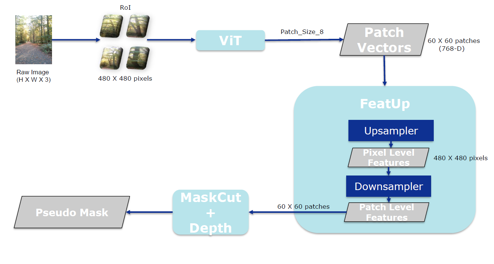
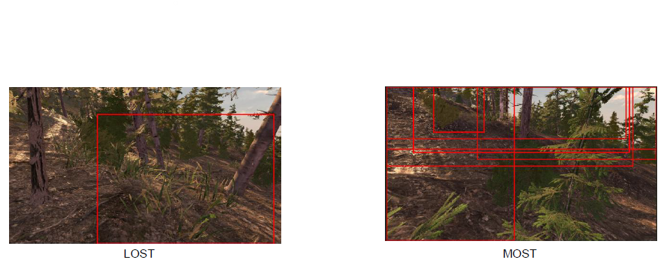
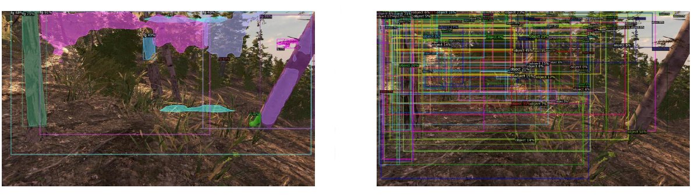
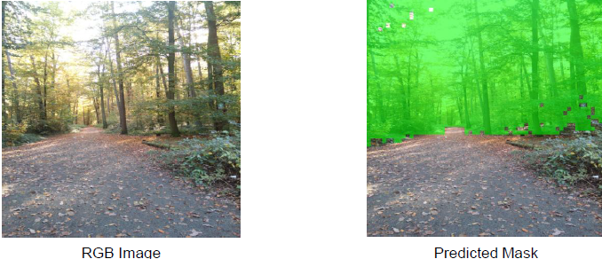
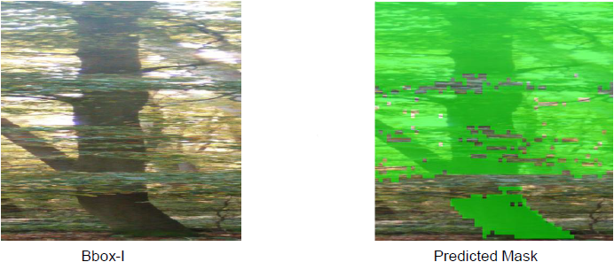
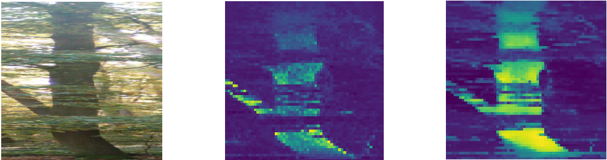
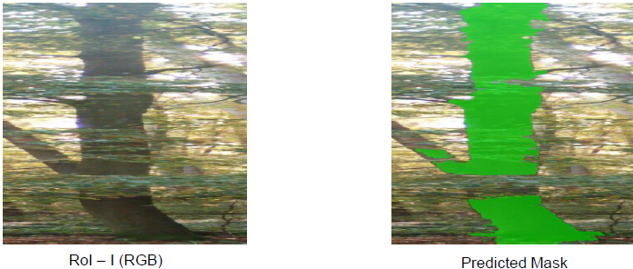
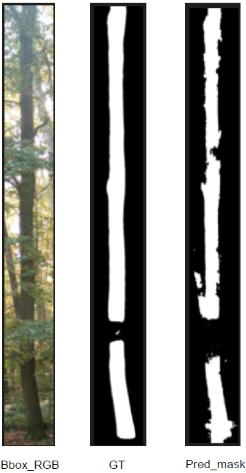
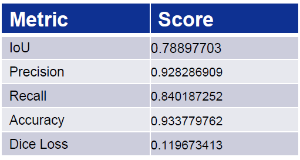

# Unsupervised-Tree-Discovery-in-Off-Road-Environment
Unsupervised Object Discovery | Computer Vision | Vision Transformer
# Abstract

Unsupervised object discovery in off-road environments is challenging due to clutter, occlusions, and lack of labeled data. This work uses a DINO-pretrained Vision Transformer with attention transfer to focus on relevant regions. Feature upsampling is applied to recover fine spatial details, while depth information improves foreground-background separation. The framework is evaluated on simulated and real-world datasets, generating pseudo-masks for detector training. Results show that bounding-box guidance and depth cues enhance localization, though MaskCut remains sensitive to clutter and occlusion. Overall, the study demonstrates the potential and limitations of unsupervised pipelines in complex off-road scenarios.

# Problem Statement

In off-road environments, the background often dominates the image, making it difficult to distinguish and localize target objects such as tree trunks. Existing self-supervised object discovery methods struggle in such scenarios due to occlusions, overlapping structures, and complex natural clutter. Additionally, the lack of diverse annotated off-road datasets under varying conditions limits the effectiveness of supervised approaches. This research addresses these challenges using unsupervised and weakly supervised techniques, supported by synthetic data generation. It also emphasizes domain generalization to ensure robustness when transferring from simulated training data to real-world environments.

# Proposed Approach

This work proposes an unsupervised pipeline for object discovery in complex off-road environments using transformer-based features, feature upsampling, and depth integration.

- Use **DINO-pretrained Vision Transformer (ViT)** to extract semantic features  
- Apply **attention transfer with bounding-box guidance** to focus on the region of interest  
- Use **FeatUp** to upsample features and recover fine spatial details  
- Construct an **affinity matrix** and apply **MaskCut** for foreground-background partitioning  
- Integrate **depth information** to improve separation in visually similar regions  
- Generate **pseudo-masks** for object localization and downstream tasks  

**Key Idea:** Combine semantic features, spatial refinement, and geometric cues to improve unsupervised object discovery in cluttered off-road scenes.

# Methodology

The proposed method follows a multi-stage pipeline combining transformer-based features, graph-based segmentation, and depth cues for unsupervised object discovery.

<p align="center">
  <br>
  <em>Pipeline: ViT → FeatUp → Depth → MaskCut</em>
</p>

### 1. Feature Extraction (DINO ViT)
- Use a **DINO-pretrained Vision Transformer** to extract patch-level features  
- Images are resized to a fixed resolution (e.g., 480×480)  
- Features capture semantic information but have low spatial resolution  

### 2. ROI Guidance (Attention Transfer)
- Apply **bounding-box-based weak supervision**  
- Guide the model to focus on the **target region (tree trunk)**  
- Reduce background dominance in feature representation  

### 3. Feature Upsampling (FeatUp)
- Use **FeatUp** to convert patch-level features into dense pixel-level features  
- Improves spatial continuity and localization  
- May introduce slight smoothing at object boundaries

### 4. Depth Integration
- Incorporate **depth information** to refine segmentation  
- Improve separation in regions with similar RGB appearance  
- Use depth similarity constraints to control mask spread 

### 5. Graph Construction
- Construct an **affinity matrix** using cosine similarity between feature vectors  
- Apply threshold (τ) to retain strong feature relationships  
- Form a graph where nodes represent patches/pixels  

### 6. MaskCut Segmentation
- Compute the **second smallest eigenvector** of the normalized graph Laplacian  
- Perform bipartition to separate **foreground and background**  
- Extract connected components to obtain object masks  

### 7. Pseudo-Mask Generation
- Generate object masks from segmentation output  
- Refine masks using post-processing (if applicable)  
- Use pseudo-masks for evaluation and downstream tasks  

# Repository Structure
```bash
repo/
│
├── README.md
├── requirements.txt
├── environment.yml (optional)
│
├── data/
│   ├── sample/              # small demo data (never full dataset)
│   └── README.md            # how to get full dataset
│
├── notebooks/               # exploratory work (cleaned versions only)
│   ├── baseline_maskcut.ipynb
│   ├── featup_analysis.ipynb
│   └── depth_integration.ipynb
│
├── src/                     # main code (very important ⭐)
│   ├── feature_extraction/
│   ├── maskcut/
│   ├── featup/
│   ├── depth/
│   └── utils/
│
├── scripts/                 # runnable scripts
│   ├── run_baseline.py
│   ├── run_featup.py
│   ├── run_depth.py
│   └── evaluate.py
│
├── experiments/             # experiment configs (not raw clutter)
│   ├── baseline/
│   ├── featup/
│   └── depth/
│
├── outputs/                 # results (organized)
│   ├── baseline/
│   ├── featup/
│   ├── depth/
│   └── comparisons/
│
├── images/                  # for README (important)
│   ├── pipeline.png
│   ├── results.png
│   └── comparisons.png
│
└── docs/                    # optional
    └── report.pdf
```
    
# Installation
asdf
# Usage
asdf
# Experiments

This section evaluates different configurations of the proposed pipeline to analyze their effectiveness in off-road object discovery.

### 🔹 Baseline Comparison
- Evaluate existing methods (e.g., LOST, MOST, MaskCut, CutLER) as baselines  
 
<p align="center">
  <br>
  <em>Discovery Methods: LOST and MOST</em>
</p>

<p align="center">
  <br>
  <em>Recent Methodologies: Left - CutLER and Right - CuVLER</em>
</p>

***Conclusion:*** CutLER is chosen as the foundational model, as it demonstrates superior performance in detecting and localizing tree structures in complex off-road environments.

### 🔹 Model Selection
- Analyze different ViT configurations (architecture, patch size, features)  
- Select the best-performing setup for further experiments

***Conclusion:*** The ViT-Base model is selected for its rich feature representation, while a patch size of 8 is chosen to effectively capture both global context and fine-grained local details.

### 🔹 Zero-Shot Domain Transfer
- Train on simulated data and test on real-world off-road images  
- Evaluate the model’s ability to generalize without retraining

<p align="center">
  <br>
  <em>Zero-Shot Domain Transfer</em>
</p>

***Conclusion:*** Scattered features, thin bark structures, and limited spatial dominance lead to poor foreground separation, causing the bark to diffuse into the background.

### 🔹 Performance on Bounding Boxes
- Apply weak supervision using bounding boxes  
- Study how ROI guidance improves localization and reduces background noise

<p align="center">
  <br>
  <em>Performance on a Bounding Box</em>
</p>

***Conclusion:*** Bounding-box-based localization results in coarse, blocky masks with poor alignment to tree bark edges, leading to inaccurate localization.

### 🔹 FeatUp Performance
- Evaluate the impact of feature upsampling on spatial resolution 

<p align="center">
  <br>
  <em>Results before and after applying FeatUp</em>
</p>

***Conclusion:*** FeatUp produces dense pixel-level representations that preserve thin structures and edges, resulting in continuous bark regions with strong foreground dominance.

### 🔹 Depth-Integrated MaskCut
- Incorporate depth information into the segmentation process  
- Analyze improvements in foreground-background separation

<p align="center">
  <br>
  <em>Zero-Shot Domain Transfer</em>
</p>

***Conclusion:*** Incorporating depth with FeatUp-based features refines MaskCut segmentation by limiting cross-region similarity, leading to better foreground isolation.

# Results

The experimental results demonstrate the effectiveness of the proposed modifications over the baseline MaskCut approach in challenging off-road environments.

### 🔹 Key Observations
- **CutLER (Baseline Selection):** Shows relatively better performance in localizing tree structures compared to other methods, and is selected as the base model  
- **Bounding Box Guidance:** Reduces irrelevant background regions and improves focus on the target object  
- **FeatUp (Feature Upsampling):** Enhances spatial continuity and produces denser representations, leading to improved mask coverage  
- **Depth Integration:** Improves foreground-background separation, especially in regions with similar color and texture

### 🔹 Qualitative Results
- More accurate localization of tree bark in cluttered scenes  
- Improved segmentation in partially visible regions  
- Challenges remain in cases of heavy occlusion and overlapping objects

<p align="center">
  <br>
  <em>Qualitative Result</em>
</p>  

### 🔹 Quantitative Insights
- Improved **IoU and Dice scores** observed with FeatUp and depth integration  
- Better **precision and recall** due to reduced background noise  
- Slight trade-off in **boundary sharpness**, with masks appearing smoother  

<p align="center">
  <br>
  <em>Qualitative Result</em>
</p>
  
# Evaluation Metrics

### 🔹 Performance Metrics

- **IoU (Intersection over Union):** Measures overlap between predicted and ground truth masks  
- **Dice Score:** Evaluates similarity between predicted and actual regions  
- **Precision:** Correctly predicted foreground pixels out of all predicted foreground  
- **Recall:** Correctly detected foreground pixels out of actual foreground  
- **Accuracy:** Overall pixel-wise correctness  
- **Boundary IoU:** Measures alignment of predicted and true object boundaries  

### 🔹 Loss Metrics
- **Binary Cross-Entropy (BCE):** Pixel-wise prediction error  
- **Dice Loss:** Measures dissimilarity between predicted and ground truth masks
- **Over-segmentation (OverSeg):** Extra predicted region beyond ground truth  
- **Under-segmentation (UnderSeg):** Missed regions of the actual object

# Limitations


- **Occlusion & Fragmented Segmentation:** Due to occlusion, objects are partially visible, leading to segmentation in fragmented regions rather than a single coherent mask  
- **Bias Toward Dominant Objects:** Spatially dominant bark regions are preferred, while smaller or weaker regions are often missed  
- **Background Clutter:** Bounding boxes still include irrelevant regions (branches, bushes, overlapping trunks), affecting accuracy  
- **Computation Overhead (FeatUp):** Feature upsampling requires significant computation and per-image training  
- **Limited Ground Truth:** Lack of reliable annotations restricts comprehensive quantitative evaluation  
- **MaskCut Sensitivity:** Performance degrades in highly cluttered, non-object-centric forest scenes  
- **Depth Limitations:** Depth alone is insufficient for precise segmentation, especially at patch-level resolution
  
# Future Work

- **Efficient Upsampling:** Explore faster alternatives such as Joint Bilateral Upsampling (JBU) to reduce computation time and avoid per-image training  
- **Advanced Graph Partitioning:** Replace binary foreground–background segmentation with clustering-based approaches for multi-object discovery  
- **Multi-Resolution Features:** Combine local and global cues to improve mask precision and capture fine details

# References

- [Localizing Objects with Self-Supervised Transformers and no Labels (Siméoni et al., 2021)](https://arxiv.org/abs/2109.14279)
- [Self-Supervised Transformers for Unsupervised Object Discovery using Normalized Cut (Wang et al., 2022)](https://arxiv.org/abs/2202.11539)
- [MOST: Multiple Object Localization with Self-supervised Transformers for Object Discovery (Rambhatla et al., 2023)](https://arxiv.org/abs/2304.05387)
- [Cut and Learn for Unsupervised Object Detection and Instance Segmentation (Wang et al., 2023)](https://arxiv.org/abs/2301.11320)
- [FeatUp: A Model-Agnostic Framework for Features at Any Resolution (Fu et al., 2024)](https://arxiv.org/abs/2403.10516)
- [CuVLER: Enhanced Unsupervised Object Discoveries through Exhaustive Self-Supervised Transformers (Arica et al., 2024)](https://arxiv.org/abs/2403.07700v1)
